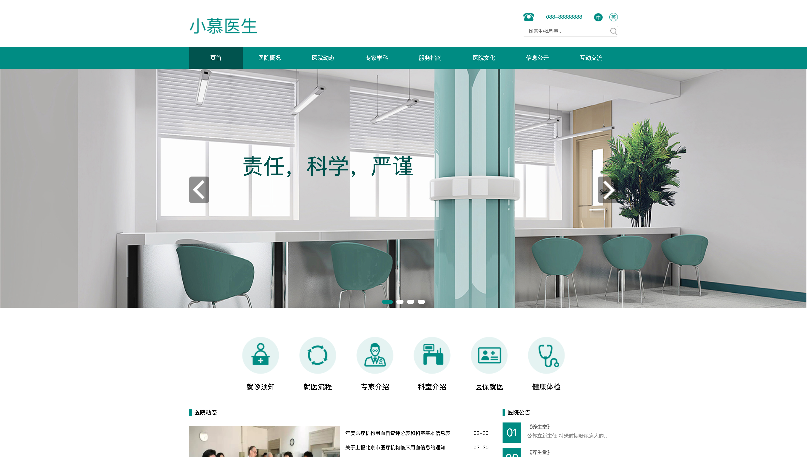

# 小慕医生
## 关于
前端学习练习项目，技术栈 HTML + CSS  
## 涉及知识点  
### HTML  
- HTML新引入标签 (main, header, nav, section...)  
- 文本标签  
- 超链接标签  
- 列表标签（有序列表，无序列表，定义列表）  
- 如何选择适合的标签来实现内容布局   

### CSS
- 选择器
- 层叠、优先级、继承
- 伪元素，伪类（为列表中某一个元素设置特殊样式）
- 盒子模型（margin, padding, border）
- 浮动（BFC，清除浮动）
- 图片相关（普通图片、背景图、图片定位、铺设方式）
- 元素布局（块级元素，行内元素，行内块元素）
- 定位（相对定位，绝对定位）
- sprites (CSS精灵，雪碧图) 
- 元素圆角
  
### 其他
- 设计稿的理解和使用 
- vscode编辑技巧 

## 成品展示
